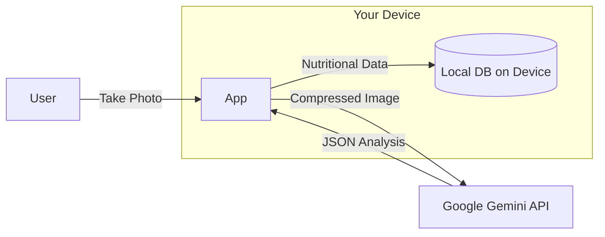

# Privacy Policy

**OpenCalories** is designed with a "Local-First" and "Privacy-First" philosophy. We believe your nutritional data belongs to you, and you should have full control over it.

## 🔒 Core Privacy Principles

1. **No Accounts**: We do not require you to create an account or provide an email address.
2. **Local Storage**: All your meal history, daily goals, and settings are stored **only on your device** using an encrypted SQLite database (Drift).
3. **Secure Secrets**: Your Gemini API Key is stored in the device's **Secure Storage** (Keychain for iOS, Keystore for Android). It is never sent to our servers.

## 📊 Data Flow

The following diagram illustrates how your data is handled:

### 1. Image Analysis

When you use the food scanner, the app:

- Compresses the image locally.
- Sends the image **directly to Google's Gemini API** using your provided API key.
- Receiving the analysis result and displaying it to you.
- **The image is NOT stored on any server by OpenCalories.**

### 2. Analytics

OpenCalories does not use any third-party analytics (like Firebase Analytics or Mixpanel) in the default build.

## 🛠️ Your Control

- **Delete Data**: You can clear your entire history at any time from the Settings screen.
- **Revoke API Key**: You can remove or change your API key at any time.

## 📞 Contact

If you have any questions about this privacy policy, please open an issue in the repository.
