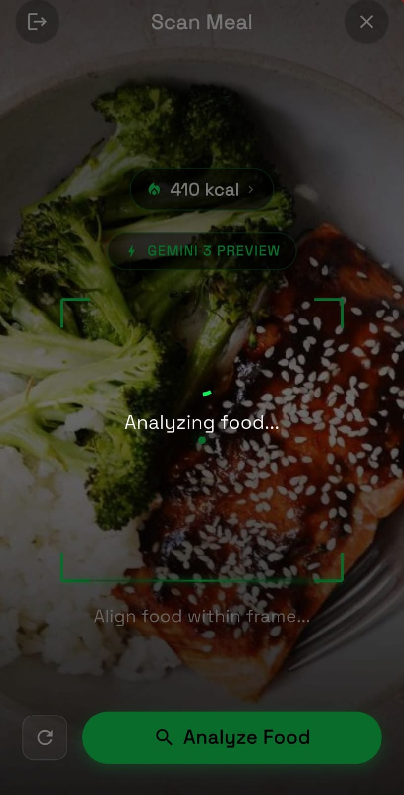
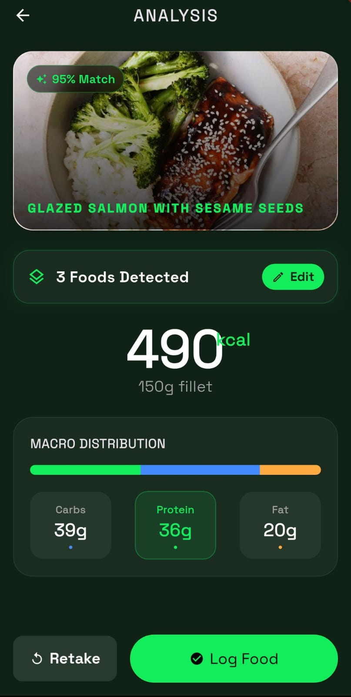
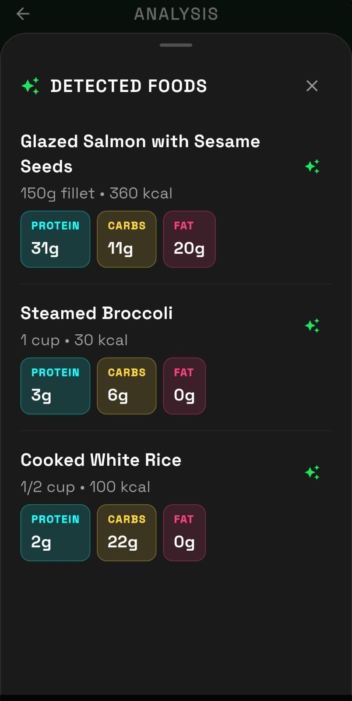
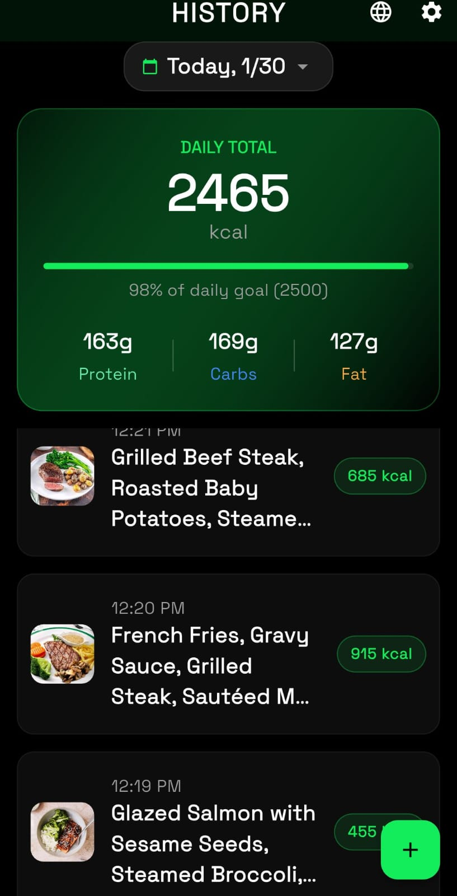
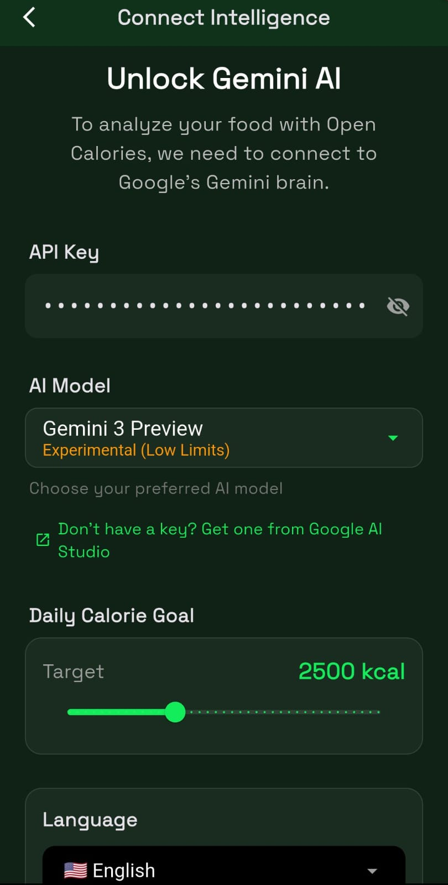

# 🥑 OpenCalories

**OpenCalories** is an AI-powered nutrition tracker built with Flutter. It leverages **Google's Gemini** models to analyze food images in real-time, estimating calories and macronutrients (Protein, Carbs, Fat) with remarkable accuracy.

[](https://flutter.dev/)
[](https://dart.dev/)
[](https://riverpod.dev/)
[](https://drift.simonbinder.eu/)
[](LICENSE)

## 📱 Supported Platforms

| Android | iOS | Windows | macOS | Linux | Web |
| :-----: | :-: | :-----: | :---: | :---: | :-: |
|   ✅    | ✅  |   ✅    |  ✅   |  ✅   | ✅  |

---

## ✨ Features

- **📸 AI Food Analysis** — Snap a photo or upload from gallery. The app identifies the food and breaks down its nutritional value using Generative AI.
- **🔒 Privacy First** — Your **Gemini API Key** is stored securely on your device using `flutter_secure_storage`. It is never sent to any third-party server other than Google's API directly.
- **💾 Local Persistence** — Meal history is saved locally using **Drift (SQLite)**. No account creation or cloud sync required—your data stays yours.
- **🌔 Modern UI** — Sleek dark/light mode adaptable design with glassmorphism elements, **haptic feedback**, and smooth animations.
- **📊 Macro Tracking** — Visual breakdown of your daily macronutrient intake with a **Daily Calorie Goal** progress bar.
- **📝 Manual Entry** — Log food manually with AI assistance for estimation, perfect for when you can't snap a photo.
- **🎓 Interactive Tutorials** — Built-in guides to help you master the app's features in seconds.
- **🌐 Multi-Language** — Available in **English** and **Spanish**, with easy support for adding more languages.

---

## 🛠️ Tech Stack

| Category                 | Technology                                                            |
| ------------------------ | --------------------------------------------------------------------- |
| **Framework**            | [Flutter](https://flutter.dev/)                                       |
| **Language**             | [Dart](https://dart.dev/)                                             |
| **State Management**     | [Riverpod](https://riverpod.dev/) (Generator & Hooks)                 |
| **Local Database**       | [Drift](https://drift.simonbinder.eu/) + SQLite                       |
| **AI Integration**       | [google_generative_ai](https://pub.dev/packages/google_generative_ai) |
| **Routing**              | [GoRouter](https://pub.dev/packages/go_router)                        |
| **Code Generation**      | [Freezed](https://pub.dev/packages/freezed) & `build_runner`          |
| **Internationalization** | Flutter's built-in `intl` package                                     |

---

## 🚀 Getting Started

### Prerequisites

1. **Flutter SDK** — Ensure you have [Flutter installed](https://docs.flutter.dev/get-started/install). Run `flutter doctor` to verify.
2. **Android Command Line Tools** — Required for Android builds. You can download just the [command line tools](https://developer.android.com/studio#command-line-tools-only) if you prefer not to install the full Android Studio.
3. **Gemini API Key** — Get a free API key from [Google AI Studio](https://aistudio.google.com/app/apikey).

### Installation

1. **Clone the repository**:

   ```bash
   git clone https://github.com/RicardoFv2/opencalories.git
   cd opencalories
   ```

2. **Install dependencies**:

   ```bash
   flutter pub get
   ```

3. **Run the app**:

   ```bash
   # For Windows
   flutter run -d windows

   # For Android/iOS (replace with your device ID)
   flutter run -d <device_id>

   # For Web
   flutter run -d chrome
   ```

4. **Connect to AI**:
   - On first launch, tap **"Get one from Google AI Studio"** if you don't have a key.
   - Paste your API Key to unlock the food scanner.

---

## 📱 Screenshots

|                  Scanner (Cyberpunk UI)                  |                     AI Analysis Result                     |                    Food Detection Mode                    |
| :------------------------------------------------------: | :--------------------------------------------------------: | :-------------------------------------------------------: |
|  |  |  |

|                    History & Progress                     |                       Secure Setup                       |
| :-------------------------------------------------------: | :------------------------------------------------------: |
|  |  |

---

## 🤝 Contributing

Contributions are welcome! Here's how you can help:

1. **Fork** the repository
2. **Create** a feature branch (`git checkout -b feature/amazing-feature`)
3. **Commit** your changes (`git commit -m 'Add amazing feature'`)
4. **Push** to the branch (`git push origin feature/amazing-feature`)
5. **Open** a Pull Request

### Ideas for Contributions

- 🌍 Add translations for more languages
- 🎨 UI/UX improvements
- 📊 New data visualization features
- 🐛 Bug fixes and performance improvements
- 📝 Documentation improvements

---

## 🛡️ Security

If you discover any security-related issues, please do NOT open a public issue. Instead, please report them privately by opening a [GitHub Security Advisory](https://github.com/RicardoFv2/opencalories/security/advisories/new).

---

## 📄 License

This project is open source and available under the [MIT License](LICENSE).

---

<p align="center">
  Made with ❤️ and Flutter
</p>
